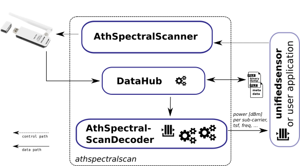

## What is this? 

This is a Python 3 library for the [ath9k spectral scan](https://wireless.wiki.kernel.org/en/users/drivers/ath9k/spectral_scan)
feature. It provides a convenient wrapper for the ```spectral_scan_*``` debugfs files and a decoder for the spectral
scan frame format. Also it configures the Wi-Fi interface for you.

This tool was written by Robert Felten for his master thesis _"Design and prototypical implementation of a Radio
Measurement Map"_.

## Example Session
 
See ```examples/```


## Dependencies

 * iw, ifconfig, sudo
 * sudo apt-get install python3-setuptools
 * $USER in the sudoers file
 * ```/sys/kernel/debug``` needs to be read+writeable for the current user
 or ```$ sudo chmod -R 777 /sys/kernel/debug``` (maybe a bad idea)
  

## Installation

```
$ sudo python3 setup.py install athspectralscan
```


## Overview




The ```AthSpectralScanner``` is used to configure the interface/spectral scan appropriately.
Then the spectral data is read-out by the ```DataHub``` class. The spectral data can be stored to a file 
or passed into a queue for "real-time" decoding. The ```AthSpectralScanDecoder``` parses the binary spectral 
data and transform it into something meaning full, e.g. time, frequency, power (dBm).


## More Detailed Documentation (API)

The folder ```examples/``` contains several example how to use the API.

AthSpectralScanner:
 
 * AthSpectralScanner(wifi_interface) - Creates a new instance of AthSpectralScanner class. Need the Wi-Fi interface name as parameter
 * set_mode_chanscan() - Set the ath9k spectral scan feature into Chanscan mode
 * set_mode_background() - Set the ath9k spectral scan feature into Background mode
 * set_mode_manual() - Set the ath9k spectral scan feature into Manual mode
 * set_mode_disable() - Disable the ath9k spectral scan feature
 * trigger() - Trigger a measurement when in Background or Manual Mode
 * set_spectral_count(int 0-255) - Set the number of spectral samples per sampling
 * set_spectral_fft_period(int 0-15) - Sets the duration of the FFT period ( spectral short repeat must be disabled (0))
 * set_spectral_period(int 0-255) - Sets the duration between two measurements
 * set_spectral_short_repeat(int 0-1) -  Enable the short measurement duration (4us, single sample) or long measurements (204us, multiple, maybe corrupted samples with the same TSF value. Amount depends on spectral_scan_fft_period)
 * set_channel(int channel number) - Tune to given channel (only in Background mode)
 * set_frequency(int frequency [MHz]) - Tune to given frequency (only in Background mode)
 * start() - Issue a trigger (for BG/manual) or start a sub-process for chanscan
 * stop() - Tear down spectral scanning and remove sub-process (chanscan)
 * str get_mode() - Query for the current mode, returns a string
 * json get_config() Querty for the current configuration, return a JSON string

AthSpectralScanDecoder:
 * AthSpectralScanDecoder(input_queue_timeout) - Creates a new AthSpectralScanDecoder instance. Mandatory parameter is the timeout used to stop the Dedcoder if the input queue is emtpy for that timeout
 * set_output_queue(Queue q) - The user have to provide a output queue, otherwise the decoding make no sense
 * set_number_of_processes(int i) - Number of processes used for decoding.
 _Warning_: If use more than one process the decoded samples are maybe out-of-order at the output queue
 * disable_pwr_decoding() - Disable the CPU intense decoding of pwr. Still decoded: tsf, freq, noise, rssi
 * enqueue(sample) - Input. Place raw ath9k spectral samples here
 * start() - start to read the input queue, decode and store to the output queue
 * stop() - Tear down the decoding process(es)
 * bool is_finished() - Test if decoder was disabled or input queue was empty longer than a time out

DataHub:
 * DataHub(scanner, dump_file_in, dump_file_out, decoder) - Creates a new DataHub. If a AthSpectralScanner instance as ```scanner``` is given, DataHub read from there. Otherwise a filename in ```dump_file_in``` needs to be provided.
   If a filename in ```dump_file_out``` provided, the raw samples are dumped there (format see below.) If  a AthSpectralScanDecoder passed in```decoder```, the sampled are also passed there.
 * start() - Create a thread to read from input file and push data to dump_file and/or decoder
 * stop() - Destroy reader thread, write metadata (.json) and close open files

Dataformat of dump files:
 * (time stamp, length, data ): ```[8 byte unsigned integer][4 byte unsigned int][raw spetral data]``` Packed via:
  ```python
    self.dump_file_out_handle.write(struct.pack("<Q", int(ts.timestamp() * 1e9)))  # int, ns resolution
    self.dump_file_out_handle.write(struct.pack("<I", len(data)))
    self.dump_file_out_handle.write(data)
 ```
 Example to read the dump: (from DataHub class):
 ```python
# read dump file into 'data'
while len(data) > 12:
    (ts,) = struct.unpack_from('<Q', data[0:8])
    ts = ts / 1e9  # was stored as int. convert back to float, ns resolution
    (length, ) = struct.unpack_from('<I', data[8:12])
    if length > len(data[12:]):
        break  # need more data
    data = data[12:]
    sample = data[0:length]
    data = data[length:]
```
See ```DataHub``` for more details. This kind of storage keep the structure how the data was read from the kernel and allow
to distinguish (groups of) samples without decode them.
  
## Pitfalls

 * Need run as root in order to access debugfs files. Alternativly to the user needs to allow non-root
 users to acess the debugfs via ```$ sudo chmod a+rx /sys/kernel/debug```

## Open Issues / To Do

See ```developer-notes```.